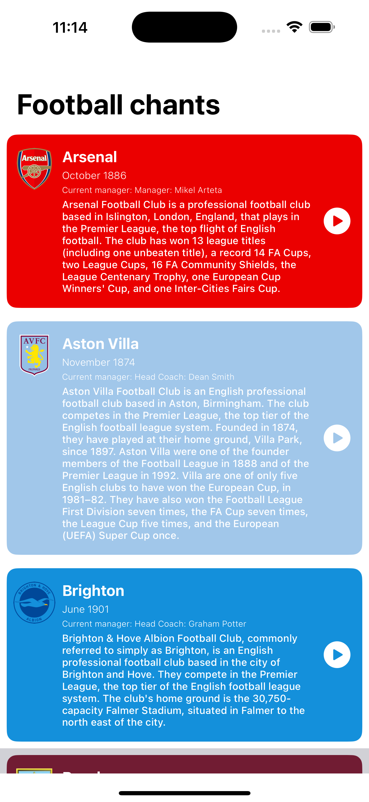

# ⚽ Football Chants iOS App

An iOS application showcasing popular football clubs in the English Premier League along with their chants and history.

## 📱 Overview

This app presents information about various Premier League football clubs, including:

- Club logo and name
- Date of establishment
- Current manager
- Club description and achievements
- A play button for each club (audio playback feature can be integrated)

Each club is displayed on a uniquely colored card styled to reflect its identity.

## 🖼️ App Screenshot

## 🧩 Features

- Scrollable list of football clubs
- Detailed club information
- Tap the play button to listen to the football chant of each club.

## 🛠️ Tech Stack

- **Language**: Swift  
- **Framework**: UIKit
- **Platform**: iOS  
- **Minimum iOS Version**: *iOS 13.0*

## 🙌 Credits

Learning Material and resources from: https://www.youtube.com/playlist?list=PLvUWi5tdh92z2YxmFJ60iuIO3J2qUC2Dn
